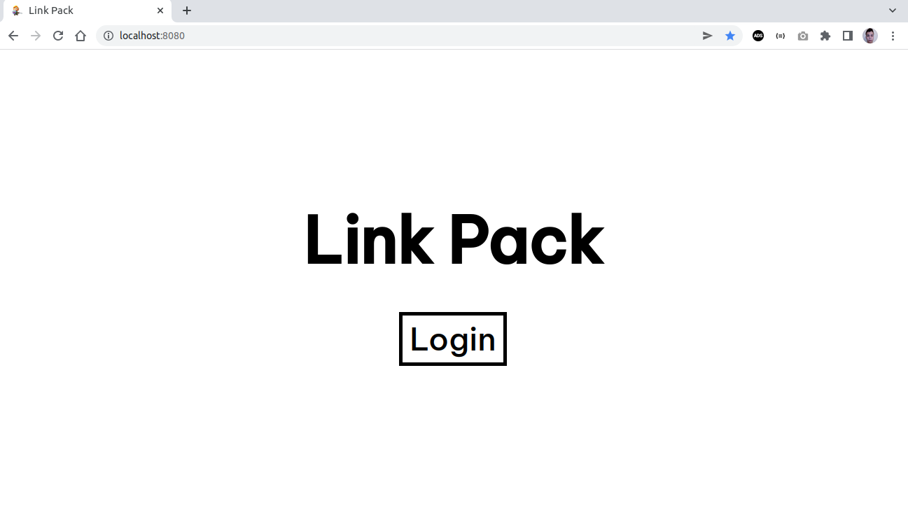
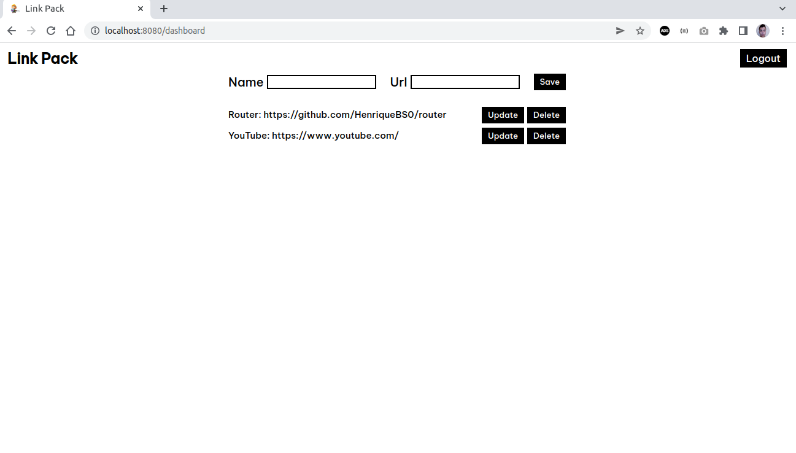

# Link Pack

Application to save links. The objective of this project is to exemplify in practice the use of the <a href="https://github.com/HenriqueBS0/router">Router</a> component.

## Home

## Dashboard

## License

#### The MIT License (MIT). Please see <a href="https://github.com/HenriqueBS0/link-pack/blob/main/LICENSE">License file</a> for more information.